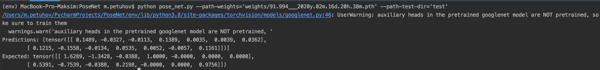

# PoseNet

The architecture of this model was inspired by the googlenet model with replace three softmax classifiers with affine regressors.  

**Outputs**

Network outputs a pose vector `p`, given by a 3D camera position `x` and orientation represented by quaternion `q`:
$$ p = [x, q] $$

## Project structure

- `dataset.py` - Class for comfortable reading data
- `common_functions.py` - Common functions for models
- `weights/ directory` - Directory with model weights and its loss value
- `pose_net.py` - PoseNet model
- `train.py` - Code for train models
- `Full.ipynb` - full code for convenience

## Commands for running files

**Train:**

`python train.py --module-name='MODULE_NAME' --path-train-dir='PATH_TO_TRAIN_DATA' --path-weights='PATH_TO_WEIGHTS'`

You can choose not to do define `--path-weights` for training an empty model.

**Prediction:**

`python pose_net.py --path-weights='PATH_TO_WEIGHTS' --path-test-dir='PATH_TO_TEST_DIR'`

## Example

## Links

[PoseNet: A Convolutional Network for Real-Time 6-DOF Camera Relocalization](https://arxiv.org/pdf/1505.07427.pdf)

[Dataset](https://yadi.sk/d/E6kkcJoHFZnZ6w)

[GoogleNet](https://arxiv.org/pdf/1409.4842.pdf)

[TorchVision - GoogleNet](https://pytorch.org/docs/stable/_modules/torchvision/models/googlenet.html)